## Introduction
This document explains Dimension Reduction includes Principle Component Analysis(PCA) and Singular Variable Decomposition(SVD)

### How to reproduce results(tested in Mac OS)
```
> R
> source("pca.R")
```

### Plots

#### Random Norm Matrix of 40 Columns
 
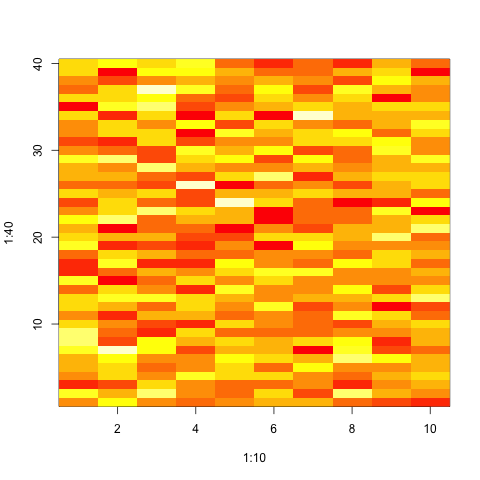 

#### Heatmap for Random Norm Matrix

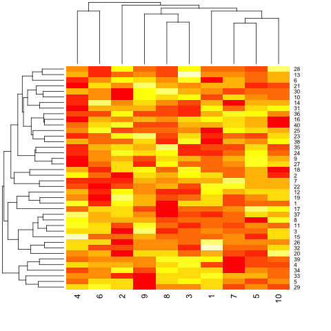 

#### Modified Sample

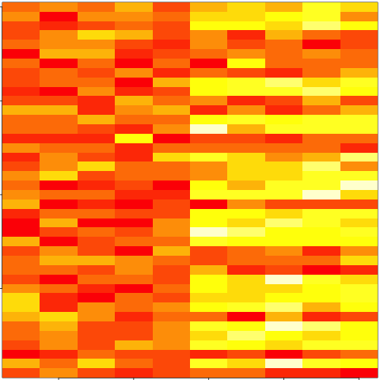 

#### Heatmap of Modified Sample

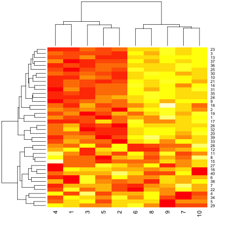 

#### Patterns in Rows and Cols

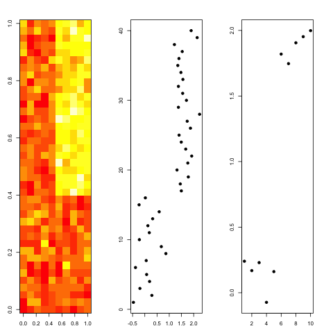 

#### SVD UV

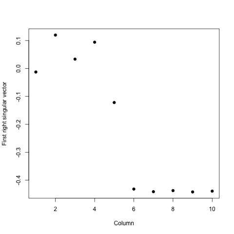 

#### SVD Variance

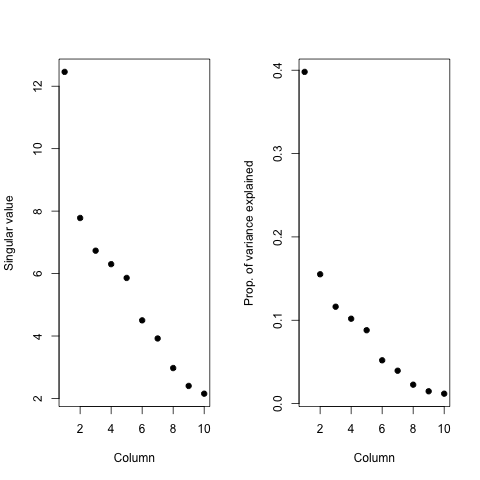 

#### SVD vs PCA

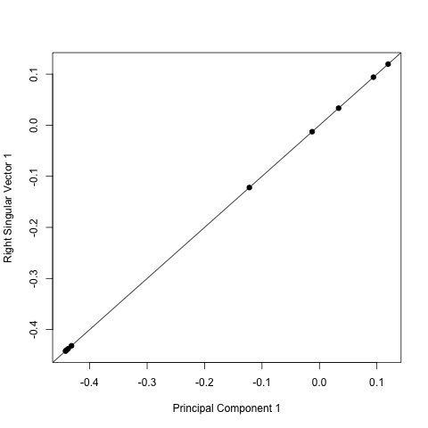 

#### Variance Explained

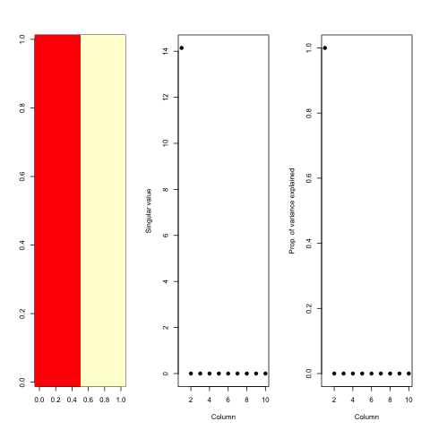 

#### SVD True Patterns

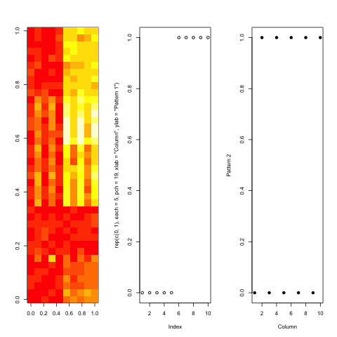 

#### V and Patterns of Variance

 

#### D and Variance Explained

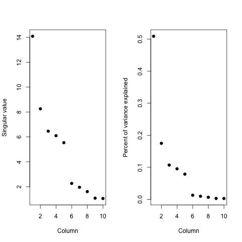 

#### Impute with K-Nearest Neighborhood Method

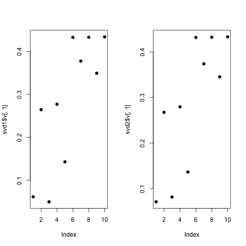 