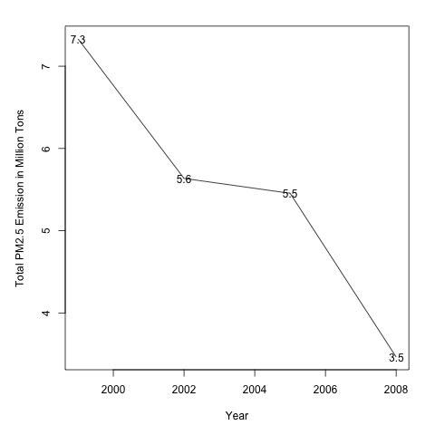
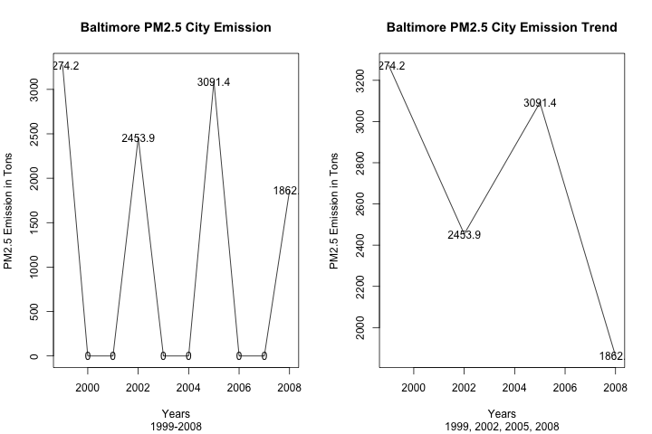
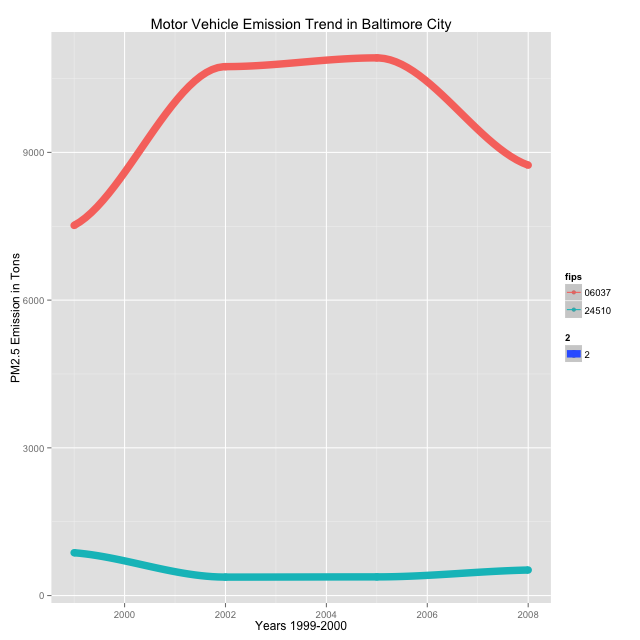
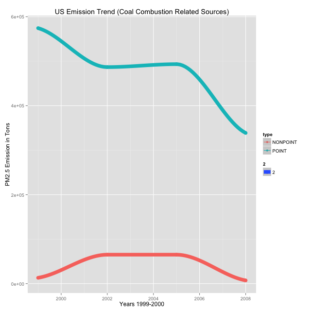
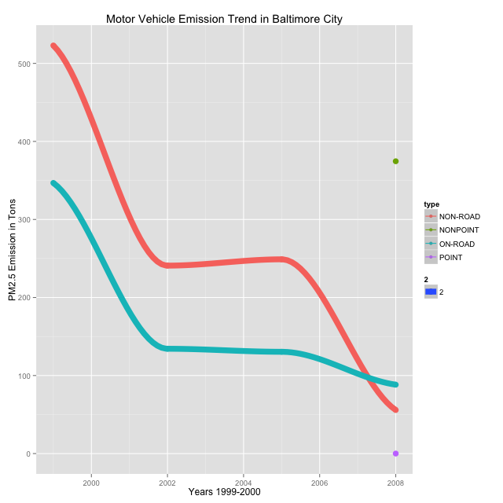
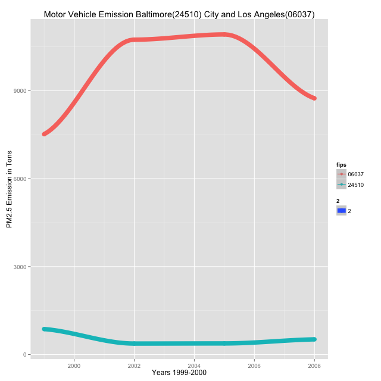

### Introduction
United States' Environmental Protection Agency(EPA) is tasked with setting antional ambient air quality standards for the fin PM and for tracking the emissions of this pollutant into the atmosphere. Approximatly every 3 years, the EPA releases its database on emissions of PM2.5. This database is known as the National Emissions Inventory (NEI). You can read more information about the NEI at the <a href="http://www.epa.gov/ttn/chief/eiinformation.html">EPA National Emissions Inventory web site.</a>

This analysis focus on the data acquired for the years 1999, 2002, 2005 and 2008

### Data Source
####Source Classification Code - SCC

This table provides a mapping from the SCC digit strings in the Emissions table to the actual name of the PM2.5 source.

#####No of Attributes: 15

```
[1] "SCC"                 "Data.Category"       "Short.Name"          "EI.Sector"          
 [5] "Option.Group"        "Option.Set"          "SCC.Level.One"       "SCC.Level.Two"      
 [9] "SCC.Level.Three"     "SCC.Level.Four"      "Map.To"              "Last.Inventory.Year"
[13] "Created_Date"        "Revised_Date"        "Usage.Notes" 
 ```
 
 ##### No of Observations: 11717


####National Emission Inventory - NEI
This table contains a data frame with all of the PM2.5 emissions data for 1999, 2002, 2005, and 2008. For each year, the table contains number of tons of PM2.5 emitted from a specific type of source for the entire year. Here are the first few rows.

#####No of Attributes: 6
```
"fips"      "SCC"       "Pollutant" "Emissions" "type"      "year"
```

#####No of Observations: 6497651


### Analysis

#### PM2.5 Emission trend from 1999-2008

Have total emissions from PM2.5 decreased in the United States from 1999 to 2008? Using the base plotting system, make a plot showing the total PM2.5 emission from all sources for each of the years 1999, 2002, 2005, and 2008.
Upload a PNG file containing your plot addressing this question.

 


#### PM2.5 Emission trend from 1999-2008

Have total emissions from PM2.5 decreased in the Baltimore City, Maryland (fips == "24510") from 1999 to 2008? Use the base plotting system to make a plot answering this question.

 


#### PM2.5 Emission trend from 1999-2008

Of the four types of sources indicated by the type (point, nonpoint, onroad, nonroad) variable, which of these four sources have seen decreases in emissions from 1999–2008 for Baltimore City? Which have seen increases in emissions from 1999–2008? Use the ggplot2 plotting system to make a plot answer this question.

 


#### PM2.5 Emission trend from 1999-2008

Across the United States, how have emissions from coal combustion-related sources changed from 1999–2008?

 


#### PM2.5 Emission trend from 1999-2008

How have emissions from motor vehicle sources changed from 1999–2008 in Baltimore City?

 


#### PM2.5 Emission trend from 1999-2008

Compare emissions from motor vehicle sources in Baltimore City with emissions from motor vehicle sources in Los Angeles County, California (fips == "06037"). Which city has seen greater changes over time in motor vehicle emissions?

 