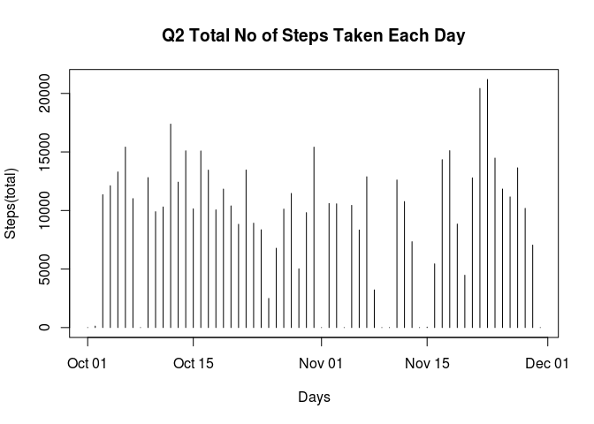
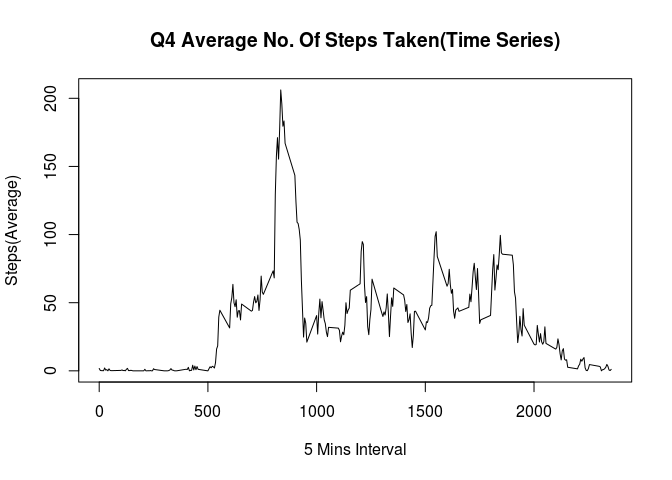
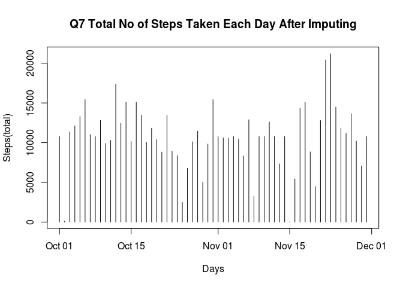

# Reproducible Research: Peer Assessment 1


## Q1 Loading and preprocessing the data

```r
# Load required libraries
library(data.table)
library(dplyr)
```

```
## 
## Attaching package: 'dplyr'
## 
## The following objects are masked from 'package:data.table':
## 
##     between, last
## 
## The following object is masked from 'package:stats':
## 
##     filter
## 
## The following objects are masked from 'package:base':
## 
##     intersect, setdiff, setequal, union
```

```r
library(lubridate)
```

```
## 
## Attaching package: 'lubridate'
## 
## The following objects are masked from 'package:data.table':
## 
##     hour, mday, month, quarter, wday, week, yday, year
```

```r
library(plyr)
```

```
## -------------------------------------------------------------------------
## You have loaded plyr after dplyr - this is likely to cause problems.
## If you need functions from both plyr and dplyr, please load plyr first, then dplyr:
## library(plyr); library(dplyr)
## -------------------------------------------------------------------------
## 
## Attaching package: 'plyr'
## 
## The following object is masked from 'package:lubridate':
## 
##     here
## 
## The following objects are masked from 'package:dplyr':
## 
##     arrange, count, desc, failwith, id, mutate, rename, summarise,
##     summarize
```

```r
library(reshape2)
library(ggplot2)
library(ggExtra)
library(gtable)
```

```
## Loading required package: grid
```

```r
data <- read.table("activity.csv", header=T, sep=',', na.strings="NA", 
                   stringsAsFactors = FALSE)
# Convert the data to table data and remove from the memory
new_data <- tbl_df(data)
rm(data)


# Mutate so that the format of Date and Time(POSIXct) column is no longer a string
new_data <- mutate(new_data, date = as.Date(date, format="%Y-%m-%d"))
```

## What is mean total number of steps taken per day?

```r
calcStepsPerDay <- function(data) {
    stepsPerDay <- ddply(
        data, 
        .(date), 
        function(x) {  
            sum(x$steps, na.rm = T)
        }
    )
    return(stepsPerDay)
}
stepsPerDay <- calcStepsPerDay(new_data)
plot(x = stepsPerDay$date, y = stepsPerDay$V1, type= "h", main = "Q2 Total No of Steps Taken Each Day",
     xlab = "Days", ylab = "Steps(total)")
```

 

```r
mean <- mean(stepsPerDay$V1)
median <- median(stepsPerDay$V1)
```

# Q3
### Mean and Median are 9354.2295082 and 10395 respectively

## What is the average daily activity pattern?

```r
average <- ddply(
    new_data, 
    .(interval), 
    function(x) {  
        mean(x$steps, na.rm = T)
    }
)
plot(x = average$interval, y = average$V1, type = "l", main = "Q4 Average No. Of Steps Taken(Time Series)",
     xlab = "5 Mins Interval", ylab = "Steps(Average)")
```

 

```r
maxInterval <- average[which.max(average$V1),]
```
# Q5
### 835th 5 minute interval contains the maximum number steps across all days.


## Imputing missing values

### Q6. Impute Strategy
>Missing variables are replaced with the population mean of the given interval.

#### Steps
* Identify the rows having NAs using complete cases.
* Reuse the average data calculated for every 5 minute interval
* Iterate through all the rows and find the NA rows
* Replace NAs with calculated averages.


```r
na_rows <- complete.cases(new_data)
noOfMissingRows <- 0
for(i in 1 : nrow(new_data)) {
    if(na_rows[i] == FALSE) {
        index <- match(new_data[i, "interval"], average$interval)
        new_data[i, "steps"] <- average[index, "V1"]
        noOfMissingRows <- noOfMissingRows + 1
    } 
}
stepsPerDay <- calcStepsPerDay(new_data)
plot(x = stepsPerDay$date, y = stepsPerDay$V1, type= "h", main = "Q7 Total No of Steps Taken Each Day After Imputing", xlab = "Days", ylab = "Steps(total)")
```

 

```r
mean <- mean(stepsPerDay$V1)
median <- median(stepsPerDay$V1)
```
### In 2304 rows data is not recorded.

### New Mean and Median are 1.0766189\times 10^{4} and 1.0766189\times 10^{4} respectively. These values are quite different from the actual values. Impact of imputing resulted in same median and mean.

## Are there differences in activity patterns between weekdays and weekends?


```r
days <- c("Saturday", "Sunday")
weekdays <- filter(new_data, is.na(match(weekdays(date), days)))
weekends <- filter(new_data, !is.na(match(weekdays(date), days)))

aveWeekdayInterval <- ddply(
    weekdays, 
    .(interval), 
    function(x) {  
        mean(x$steps, na.rm = T)
    }
)

aveWeekendInterval <- ddply(
    weekends, 
    .(interval), 
    function(x) {  
        mean(x$steps, na.rm = T)
    }
)
p1 <- ggplot(aveWeekdayInterval, aes(interval, V1)) + geom_line() + ggtitle("Q8. Average number of steps taken     across weekdays and weekends")
p2 <- ggplot(aveWeekendInterval, aes(interval, V1)) + geom_line()

gl = lapply(list(p1,p2), ggplotGrob)     
g = do.call(rbind, c(gl, size="first"))
g$widths = do.call(unit.pmax, lapply(gl, "[[", "widths"))

grid.newpage()
grid.draw(g) 
```

 


